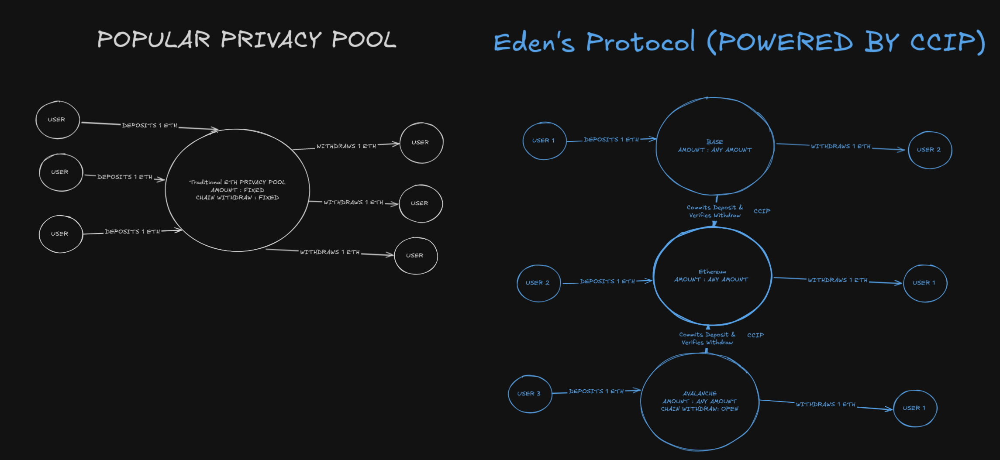

+++
date = '2025-06-29T18:42:58+01:00'
title = 'EdensProtocol'
draft = false
+++

### Summary

Eden's Protocol was a project based on Tornado Cash's (TC) idea of allowing privacy but with the additions such as:

* Cross-chain functionallity
* 1 pool, 1 token, any amount.

This idea was for the Chainlink hackathon 2025 and got me [Top 5 for the Avalanche Track.](https://blog.chain.link/announcing-the-chainlink-chromion-hackathon-winners/)

#### My Idea
I was reading through the court hearings of one of the founders for TC, he had gotten a sentence of 5 years+ in the netherlands.

Did he deserve the sentence?

In our society someone who facilitates bad money transfers will always be held accountable.

The court case and reading through blogs from TC made me wonder of an idea of cross-chain functionality for the protocol, while i can say that i knew nothing about how 'decentralized' the nodes that manage chainlink's CCIP were.I still went through with it as i have not seen this idea being built out atleast in the open.



Searching for the knowledge that was needed for creating this protocol made me find some pretty old videos of ZKroates that was an extension on Remix.
While this gave some information, it was not enough to rewrite & add the ideas i wanted to add.

After searching further for videos/content and actually starting to build building the project,i thought about adding 1 pool per token.Which would be a bad case if there mainstream adoption of the protocol, but this was a hackathon which i could try new things and ideas.

You might wondering why?
When a user decides to deposit, the merkle tree will grow by size and as this acummulates to millions of deposits this can cause Denial of Service for some users.
(Gas costs too high).

```js
    function deposit(bytes32 _commitment, uint256 amount, uint256 fee)
        external
        payable
        nonReentrant
        returns (uint256 index)
    {
        require(!commitments[_commitment], "Commitment already submitted");
        require(amount > 0);

        uint256 index = _insert(_commitment);

        commitments[_commitment] = true;

        if (asset != address(0x0)) {
            IERC20(asset).safeTransferFrom(msg.sender, address(this), amount + fee);
            feeAccumulated += fee;
        } else {
            require(msg.value >= amount + fee);

            feeAccumulated += fee;
        }

        emit Deposited(_commitment, amount, index, 0, bytes32(0), asset);
    }
```

That was not the only thing, funding the deposits by LP Pools (just as bridge protocols) do was one of the other additions i made. This would allow LP's to profit from deposits & withdraws  essentially creating a system that could last, minus point would be their LP could be bridged to multiple other chains which might dissatisfy the LP holders.


# What have i learned?
I would normally say i am grateful but after realizing and comparing my project to the winners, i feel like my idea was interesting enough..
But the way i explained it was not nice towards a new user or a judge. As there were many other projects that explained their vision and idea much better than i did.

While i would say adding the features such as depositng any amount and adding cross chain functionallity was nice , if no one can understand an idea why would it win a prize.
I should be grateful enough by winning a prize, as truly i did not deserve anything as the way i explained was very rushed and skimmed over the `why`..

I was working on the frontend and project itself until the end of the time, as this was my first time working at all with some js functionality (generating commitment hashs),
verifiying it, Verifiying a proof went wrong as i could not really store the commitment made to build the merkle tree, as i had no knowledge on how a DB worked at that time.

Overall i am grateful for the experience gained as this was my first ever hackathon.

### Resources and Links
https://github.com/plairfx/EdensProtocol-F
https://github.com/plairfx/EdensProtocolFrontend
